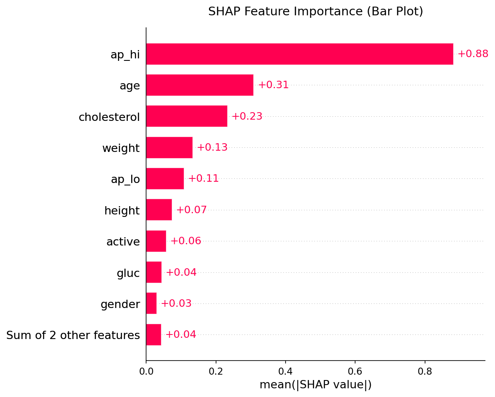

# CardioLens AI

**Explainable cardiovascular disease risk prediction**

CardioLens AI predicts a person's risk of cardiovascular disease from 11 basic health details, like age, blood pressure, cholesterol and smoking, and shows which factors raised or lowered that risk.

**Live demo:** [cardiolens-ai.vercel.app](https://cardiolens-ai.vercel.app) · **API docs:** [cardiolens-ai-za8w.onrender.com/docs](https://cardiolens-ai-za8w.onrender.com/docs)

> [!IMPORTANT]
> This is a research and learning project, not a medical tool. Do not use it to diagnose or treat anyone.

## Features

- **Risk prediction:** enter patient details to get a risk percentage, a risk level (Low, Moderate, Elevated or High) and BMI
- **Factor breakdown:** a chart showing which factors pushed the risk up or down
- **What-if simulator:** change the blood pressure and see how the risk changes
- **Report download:** save a plain-text summary of the assessment
- **Batch scoring:** send a CSV of many patients to the API and get a risk score for each

## How It Works

The model is an XGBoost classifier trained on 70,000 patient records from the Kaggle Cardiovascular Disease dataset. It beat Logistic Regression and Random Forest, and on 14,000 test patients it reaches **73.2% accuracy** and a **ROC-AUC of 0.798**.

SHAP analysis shows that systolic blood pressure is by far the biggest factor in the model's predictions, followed by age and cholesterol.

<p align="center">
  
</p>

## Tech Stack

- **ML:** Python, XGBoost, scikit-learn, SHAP
- **Backend:** FastAPI, hosted on Render
- **Frontend:** React, TypeScript, Vite, Tailwind CSS, Recharts, hosted on Vercel

## Run Locally

You need Python 3.10+ and Node.js 18+.

**1. Start the backend**

```bash
git clone https://github.com/<your-username>/cardiolens-ai.git
cd cardiolens-ai
pip install -r backend/requirements.txt
cd backend
uvicorn main:app --reload
```

The API runs at http://127.0.0.1:8000, with docs at http://127.0.0.1:8000/docs.

**2. Start the frontend** (in a new terminal, from the project folder)

```bash
cd frontend
cp .env.example .env      # Windows: copy .env.example .env
npm install
npm run dev
```

Then open http://localhost:5173.

## Project Structure

```text
backend/          FastAPI server and the trained model
frontend/         React web app
src/              Training and explainability scripts
data/             Dataset
explainability/   SHAP charts
```
